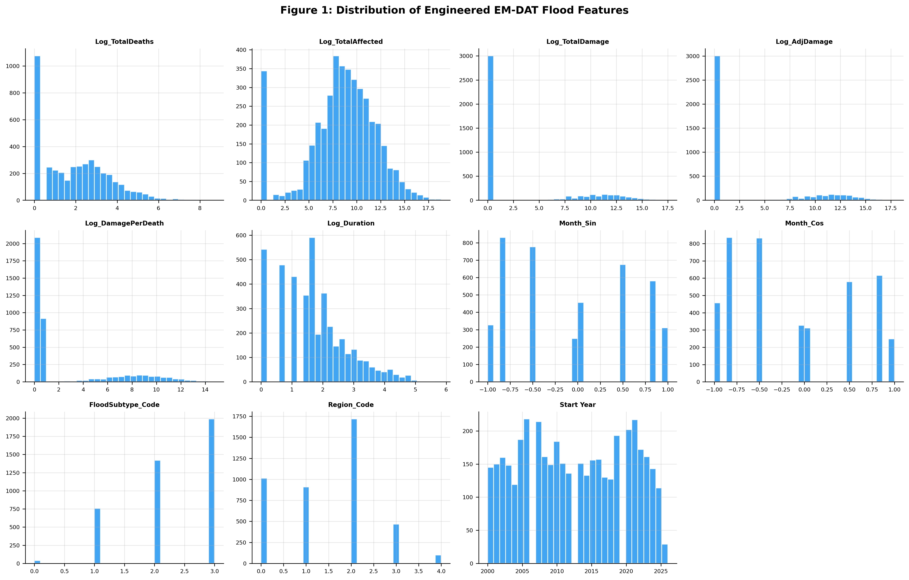
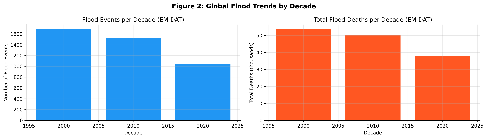
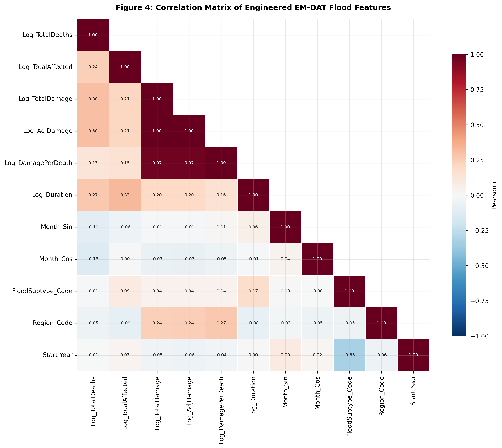
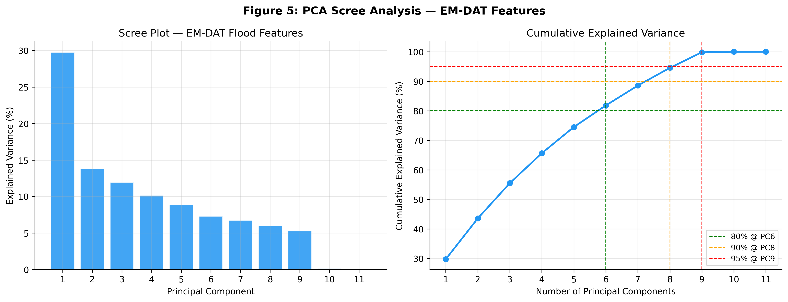
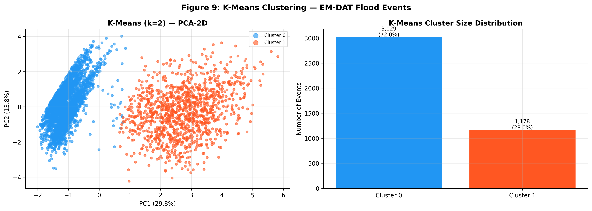
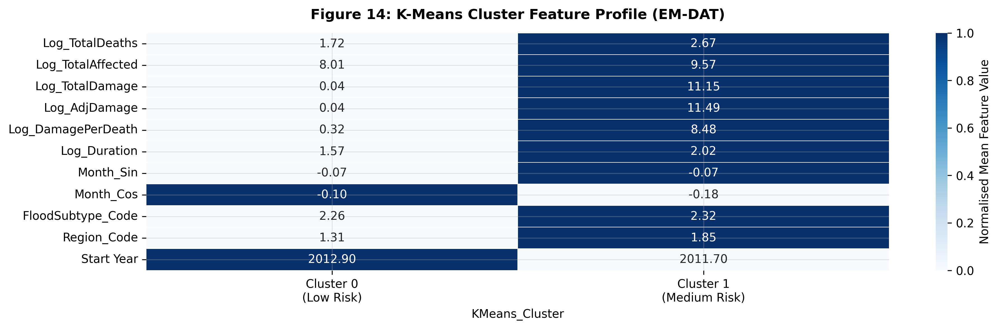
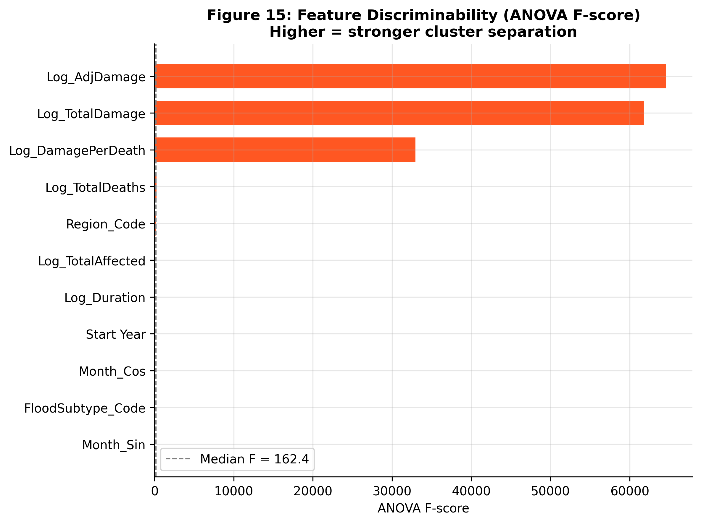
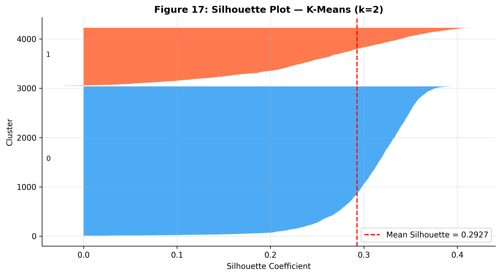

<div align="center">

# 🌊 Flood Risk Clustering Using EM-DAT Data

### Unsupervised Machine Learning Framework for Global Flood Risk Analysis


---

A comparative study of **K-Means, Gaussian Mixture Models (GMM), DBSCAN, and OPTICS** on the **EM-DAT global flood disaster dataset** using feature engineering, Principal Component Analysis (PCA), and cluster evaluation metrics.

</div>

---

# 📑 Table of Contents

- [Project Overview](#-project-overview)
- [Project Highlights](#-project-highlights)
- [Objectives](#-objectives)
- [Dataset](#-dataset)
- [Feature Engineering](#-feature-engineering)
- [Methodology](#-methodology)
- [Machine Learning Algorithms](#-machine-learning-algorithms)
- [Evaluation Metrics](#-evaluation-metrics)
- [Results](#-results)
- [Figures](#-figures)
- [Repository Structure](#-repository-structure)
- [Installation](#-installation)
- [Dependencies](#-dependencies)
- [Future Work](#-future-work)
- [Citation](#-citation)
- [Author](#-author)
- [License](#-license)

---

# 📌 Project Overview

Floods are among the most destructive natural disasters worldwide, causing extensive human, environmental, and economic losses. Understanding flood risk patterns is essential for disaster preparedness and mitigation.

This project presents an **unsupervised machine learning framework** for identifying global flood-risk patterns using the **EM-DAT (Emergency Events Database)**. Unlike many previous studies that rely on synthetic or simulated datasets, this work leverages **real-world historical flood records** and compares multiple clustering algorithms to identify meaningful flood-risk groups.

The complete workflow includes:

- Data preprocessing
- Feature engineering
- Feature scaling
- Principal Component Analysis (PCA)
- Comparative clustering
- Model evaluation
- Cluster interpretation

---

# ✨ Project Highlights

- 🌍 **4,207** historical flood events analyzed
- 📊 **11 engineered flood-impact features**
- 📉 Principal Component Analysis (PCA)
- 🤖 Comparison of **4 clustering algorithms**
- 📈 **17 publication-quality figures**
- 🏆 K-Means identified as the best-performing clustering algorithm
- 📂 Complete reproducible Jupyter Notebook

---

# 🎯 Objectives

- Perform exploratory analysis of historical flood events.
- Engineer meaningful flood-impact features.
- Reduce dimensionality using PCA.
- Compare multiple clustering algorithms.
- Identify natural flood-risk groups.
- Interpret cluster characteristics for disaster risk assessment.

---

# 📂 Dataset

**Source**

EM-DAT – The International Disaster Database

Dataset contains worldwide flood events with information such as:

- Total Deaths
- Total Affected Population
- Economic Damage
- Adjusted Economic Damage
- Event Duration
- Flood Subtype
- Region
- Start Year

---

# ⚙️ Feature Engineering

The following engineered features were used:

| Feature |
|----------|
| Log_TotalDeaths |
| Log_TotalAffected |
| Log_TotalDamage |
| Log_AdjDamage |
| Log_DamagePerDeath |
| Log_Duration |
| Month_Sin |
| Month_Cos |
| FloodSubtype_Code |
| Region_Code |
| Start Year |

All numerical variables were standardized before clustering.

---

# 🔬 Methodology

```
EM-DAT Dataset
      │
      ▼
Data Cleaning
      │
      ▼
Feature Engineering
      │
      ▼
Standardization
      │
      ▼
Principal Component Analysis (PCA)
      │
      ▼
Clustering Algorithms
      │
      ├── K-Means
      ├── Gaussian Mixture Model
      ├── DBSCAN
      └── OPTICS
      │
      ▼
Cluster Evaluation
      │
      ▼
Flood Risk Interpretation
```

---

# 🤖 Machine Learning Algorithms

The following clustering algorithms were evaluated:

| Algorithm | Description |
|------------|------------|
| K-Means | Partition-based clustering |
| Gaussian Mixture Model | Probabilistic clustering |
| DBSCAN | Density-based clustering |
| OPTICS | Density-based hierarchical clustering |

---

# 📊 Evaluation Metrics

Models were evaluated using:

- Silhouette Score
- Calinski-Harabasz Index
- Davies-Bouldin Index
- Adjusted Rand Index (ARI)
- Normalized Mutual Information (NMI)

---

# 📈 Results

The analysis identified **two natural flood-risk clusters** representing different levels of flood severity.

## Key Findings

- ✅ K-Means achieved the best clustering performance.
- ✅ PCA retained approximately **95%** of the total variance.
- ✅ Economic damage variables were the strongest contributors to cluster separation.
- ✅ Asia experienced the highest flood impacts.
- ✅ DBSCAN and OPTICS were less effective because of the density characteristics of the dataset.

---

## 🏆 Model Comparison

| Algorithm | Performance |
|------------|------------|
| 🥇 K-Means | Best Overall |
| 🥈 Gaussian Mixture Model | Good |
| 🥉 DBSCAN | Moderate |
| OPTICS | Weak |

---

# 📷 Figures

## Feature Distributions



---

## Global Flood Trends



---

## Correlation Matrix



---

## PCA Scree Plot



---

## K-Means Clustering



---

## Cluster Feature Profiles



---

## Feature Importance (ANOVA)



---

## Silhouette Plot



---

# 📁 Repository Structure

```text
Flood-Risk-Clustering-EMDAT/
│
├── data/
│   ├── public_emdat_2026-06-22.xlsx
│   └── public_emdat_incl_hist_2026-06-22.xlsx
│
├── figures/
│   ├── fig1_emdat_feature_distributions.png
│   ├── ...
│   └── fig17_emdat_silhouette_plot.png
│
├── results/
│   ├── ANOVA_Feature_Importance.csv
│   ├── ClusterProfile.csv
│   ├── FloodRiskClusters.csv
│   └── Table_Cluster_Risk_Mapping.csv
│
├── Flood_Risk_Clustering_EMDAT.ipynb
├── README.md
├── requirements.txt
├── LICENSE
└── .gitignore
```

---

# 🚀 Installation

Clone the repository

```bash
git clone https://github.com/AnuragYadav12/Flood-Risk-Clustering-EMDAT.git
```

Navigate into the repository

```bash
cd Flood-Risk-Clustering-EMDAT
```

Install dependencies

```bash
pip install -r requirements.txt
```

Launch Jupyter Notebook

```bash
jupyter notebook
```

Open

```
Flood_Risk_Clustering_EMDAT.ipynb
```

Run all cells sequentially.

---

# 📦 Dependencies

- Python 3.11
- pandas
- numpy
- matplotlib
- seaborn
- scikit-learn
- scipy
- openpyxl
- jupyter

---

# 🔮 Future Work

- Deep clustering techniques
- Autoencoder-based clustering
- Explainable AI for clustering
- Satellite-based flood indicators
- Interactive dashboard
- Temporal flood-risk forecasting

---

# 📚 Citation

If you use this repository in your research, please cite:

```bibtex
@misc{yadav2026,
  author       = {Anurag Yadav},
  title        = {Flood Risk Clustering Using EM-DAT Data},
  year         = {2026},
  publisher    = {GitHub},
  howpublished = {\url{https://github.com/AnuragYadav12/Flood-Risk-Clustering-EMDAT}},
  note         = {GitHub repository}
}
```

---

# 🙏 Acknowledgements

- EM-DAT – The International Disaster Database
- Centre for Research on the Epidemiology of Disasters (CRED)
- scikit-learn
- pandas
- NumPy
- Matplotlib

---

# 👨‍💻 Author

**Anurag Yadav**

*M.Tech in Artificial Intelligence & Machine Learning*

🔗 GitHub: https://github.com/AnuragYadav12

🔗 LinkedIn: https://linkedin.com/in/Anurag-Yadav

---

# 📜 License

This project is licensed under the **MIT License**.

---

<div align="center">

## ⭐ If you found this project useful, please consider giving it a Star!

**Happy Research! 🌍📊**

</div>
